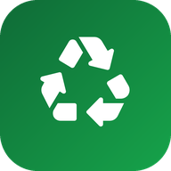
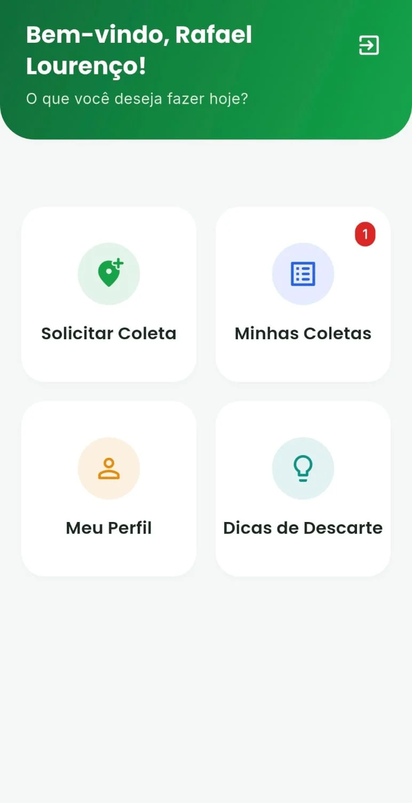
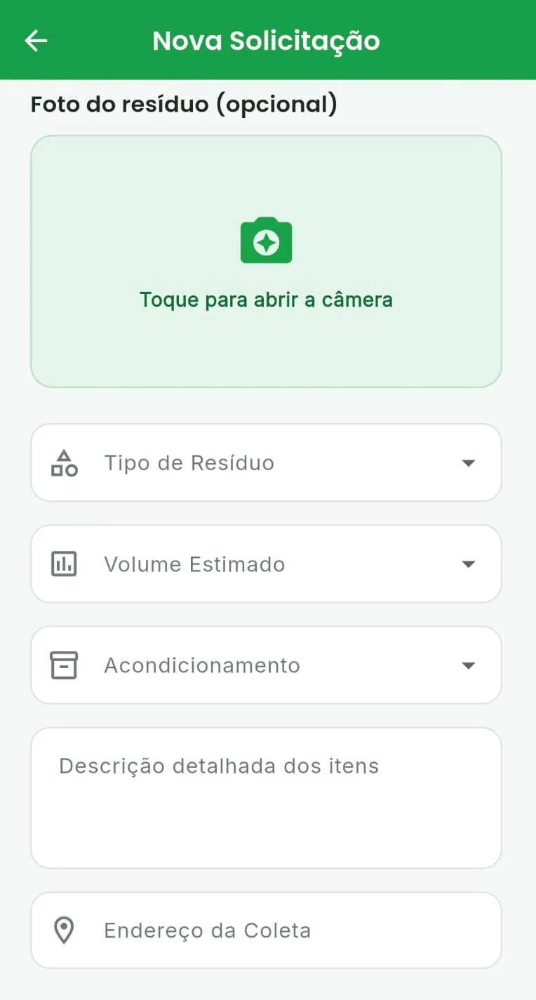

# ♻️ EcoColeta

<p align="center">
  
</p>

<h3 align="center">Descarte do jeito certo, sem sair de casa.</h3>

<p align="center">
  <a href="https://ecocoleta-app.netlify.app"><b>🌐 Acesse o site: ecocoleta-app.netlify.app</b></a>
  &nbsp;·&nbsp;
  <a href="https://github.com/rafaellourenco10/ecocoleta_app/releases/latest/download/app-release.apk"><b>📲 Baixar o APK (Android)</b></a>
</p>

<p align="center">
  
  
  
  
  
  
</p>

O **EcoColeta** é um aplicativo de zeladoria urbana que conecta cidadãos e empresas à coleta de descartes específicos (eletrônicos, recicláveis, entulho, orgânicos e outros). A pessoa informa o tipo de resíduo, o volume, o endereço e uma foto, e acompanha o pedido pelo app.

<p align="center">
  
  &nbsp;&nbsp;
  
</p>

---

## 🌐 Site oficial

O site **[ecocoleta-app.netlify.app](https://ecocoleta-app.netlify.app)** é a porta de entrada do projeto. Lá o usuário encontra:

- como o app funciona, em três passos (criar a conta, descrever o descarte e acompanhar o pedido);
- os tipos de resíduo aceitos;
- prints das telas;
- o botão de download do APK e o passo a passo de instalação no Android.

O site fica na pasta [`site/`](site/) (HTML e CSS puros, sem build) e é publicado na Netlify, com a configuração no [`netlify.toml`](netlify.toml).

---

## 📲 Instalação no celular

O app ainda não está na Play Store. A instalação é feita pelo APK:

1. Baixe o [`app-release.apk`](https://github.com/rafaellourenco10/ecocoleta_app/releases/latest/download/app-release.apk) (ou pelo botão do site).
2. Abra o arquivo no celular e permita a instalação de fontes desconhecidas, se o Android pedir.
3. Crie sua conta e solicite sua primeira coleta.

> O servidor da API usa o plano gratuito do Render. Se ninguém usou o app nos últimos minutos, o primeiro acesso pode levar de 20 a 50 segundos.

---

## 🚀 Funcionalidades

- **Cadastro** de pessoa física ou jurídica, com validação de CPF/CNPJ pelo dígito verificador, e-mail, telefone com DDD e senha.
- **Login** real na API (e-mail e senha).
- **Solicitação de coleta** com tipo de resíduo, volume, acondicionamento, descrição, endereço e foto.
- **Histórico de coletas**, com edição e cancelamento dos pedidos.
- **Perfil** do usuário, com visualização e edição dos dados.
- **Dicas de Descarte**: orientações sobre eletrônicos, óleo de cozinha, pilhas e baterias, vidros quebrados e remédios vencidos.

---

## 🆕 Novidades da versão 2.0.0

- Landing page publicada em [ecocoleta-app.netlify.app](https://ecocoleta-app.netlify.app).
- Ícone próprio do app.
- Botões das telas posicionados acima da barra de navegação do Android.
- Login real (o acesso de teste foi removido) e permissão de internet no Android.
- APK de release assinado, com o identificador `com.ecocoleta.app`.
- Camada de serviços para a API, validação dos formulários e redesign visual completo.
- Testes automatizados dos validadores.

---

## 🏗️ Arquitetura

O projeto segue uma arquitetura cliente-servidor em três camadas. O app nunca acessa o banco diretamente: toda requisição passa pela API.

```text
App Flutter (Android)  ──HTTPS/JSON──▶  API Node.js + Express (Render)  ──Admin SDK──▶  Firebase Firestore
```

- **App (este repositório):** Flutter (Dart), Material 3, pacote `http` para as requisições REST.
- **API:** Node.js com Express, hospedada no Render ([repositório da API](https://github.com/rafaellourenco10/ecocoleta_api)). Concentra as regras de negócio e o acesso ao banco.
- **Banco de dados:** Firebase Firestore (NoSQL), acessado pela API com o Firebase Admin SDK.
- **Site:** HTML estático na Netlify.

O projeto começou com PHP e MySQL rodando localmente (XAMPP) e foi migrado para essa estrutura na nuvem, o que permite usar o app de qualquer rede (4G ou Wi-Fi).

### Rotas da API

| Método | Rota | O que faz |
| --- | --- | --- |
| POST | `/api/usuarios/registrar` | Cadastra um usuário |
| POST | `/api/usuarios/login` | Faz login |
| GET | `/api/usuarios/:id` | Busca o perfil |
| PUT | `/api/usuarios/:id` | Atualiza o perfil |
| POST | `/api/coletas` | Cria uma solicitação de coleta |
| GET | `/api/coletas/usuario/:usuario_id` | Lista as coletas do usuário |
| PUT | `/api/coletas/:id` | Edita uma coleta |
| DELETE | `/api/coletas/:id` | Cancela uma coleta |

### Segurança

- Senhas guardadas com hash **bcrypt**; a API nunca devolve a senha nas respostas.
- E-mail duplicado é recusado no cadastro (HTTP 409).
- As rotas `PUT` só aceitam os campos permitidos.
- A chave do Firebase fica fora do Git (no servidor, como arquivo secreto do Render).
- APK de release assinado com chave própria.

---

## 📂 Estrutura do projeto

```text
lib/
 ┣ core/
 ┃ ┣ api_constants.dart       # URL base da API e endpoints REST
 ┃ ┣ api_exception.dart       # Erros de comunicação com mensagens amigáveis
 ┃ ┣ app_theme.dart           # Tema visual: cores (AppColors), fontes e componentes
 ┃ ┣ coleta_service.dart      # Requisições de coletas (criar, listar, editar, cancelar)
 ┃ ┣ usuario_service.dart     # Requisições de usuário (cadastro, login, perfil)
 ┃ ┗ validators.dart          # Validação de CPF/CNPJ, e-mail, telefone e senha
 ┣ screens/
 ┃ ┣ tela_cadastro.dart       # Cadastro de novos usuários
 ┃ ┣ tela_dicas.dart          # Dicas de descarte
 ┃ ┣ tela_formulario.dart     # Solicitação e edição de coletas
 ┃ ┣ tela_inicial.dart        # Painel principal e histórico de coletas
 ┃ ┣ tela_login.dart          # Login
 ┃ ┗ tela_perfil.dart         # Perfil do usuário
 ┗ main.dart                  # Ponto de entrada (MaterialApp)
site/                         # Landing page publicada na Netlify
test/
 ┗ validators_test.dart       # Testes dos validadores
```

---

## ⚙️ Como executar o projeto

### Pré-requisitos

- [Flutter SDK](https://flutter.dev/docs/get-started/install)
- Emulador Android ou um celular físico

### Passo a passo

1. **Clone o repositório:**
   ```bash
   git clone https://github.com/rafaellourenco10/ecocoleta_app.git
   cd ecocoleta_app
   ```

2. **Baixe as dependências:**
   ```bash
   flutter pub get
   ```

3. **Execute o app:**
   Por padrão, o app já aponta para a API em produção no Render.
   ```bash
   flutter run
   ```

> **Rodando com a API local:** não é preciso editar nenhum arquivo, basta passar a URL na hora de rodar:
> ```bash
> flutter run --dart-define=API_BASE_URL=http://<seu-ip-local>:3000/api
> ```
> Inicie o servidor com `node src/index.js` na pasta da API, com as credenciais do Firebase configuradas.

### Testes e análise de código

```bash
flutter test      # roda os testes dos validadores
flutter analyze   # verifica o código com o flutter_lints
```

### Gerar o APK de release

```bash
flutter build apk --release
```

O APK fica em `build/app/outputs/flutter-apk/app-release.apk`. Para publicar uma nova versão, atualize o `version` no `pubspec.yaml` e crie uma release no GitHub com o arquivo chamado exatamente `app-release.apk`. O botão do site sempre baixa a release mais recente, então o site não precisa ser alterado.

---

## 👨‍💻 Equipe

- **Rafael R. Lourenço**
- **Guilherme**
- **Geovanni**
- **João Wilson**

Desenvolvido como um ecossistema completo (Full Stack) de zeladoria urbana, com foco em arquiteturas escaláveis na nuvem.
